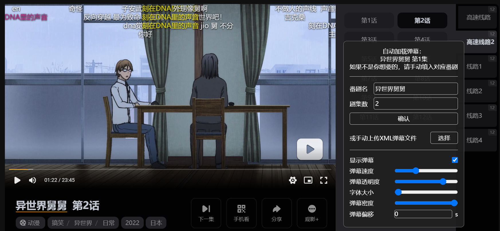

# 樱花弹幕 SakuraDanmaku

## 让樱花动漫和橘子动漫加载 Bilibili 弹幕

如果我继续使用 Bilibili 弹幕网观看番剧，那么我将成为正版番剧的受害者。神说，要把时间倒退到十年前，所以有了樱花动漫（虽然好多仿站也都在叫樱花动漫，我分不清哪个是正版）。十年前，NicoNico 已经是如火如荼发展的视频网站了，不过最引人注目的还是它的弹幕功能，后来被别的视频平台陆续抄走也足以证明弹幕这一设计的成功。所以，我也好想看樱花动漫的弹幕啊，可是樱花动漫喜欢的不是弹幕，我哭了。我知道看着既没有弹幕也没有评论区的樱花动漫我为什么要哭的，因为我只能自己写一个工具让 Bilibili 的弹幕 NTR 樱花动漫。~~反转了就喜欢 NTR 😋~~

## 使用说明

2023 年 1 月 31 日起，该脚本的主要功能均维护完毕，正式进入 1.0.0 版本。目前支持 [樱花动漫(P)](https://yhdmp.cc)和[橘子动漫](https://www.mgnacg.com)，之后看情况考虑其它站点的适配。

默认自动匹配弹幕池，但对于一些翻译有偏差/多季度/Bilibili 没有上架的动画可能无法自动填充弹幕池，因此有时需要从左侧的面板自行选择匹配的番剧名称（如果有的话）。

## 反馈地址

Greasy Fork: <https://greasyfork.org/en/scripts/455196-sakuradanmaku>

GitHub: <https://github.com/MUTED64/SakuraDanmaku>

## 已实现的功能

- [x] 加载 Bilibili 弹幕
- [x] 交互式调整弹幕样式并嵌入 Control Bar
- [x] 偏移时间调节
- [x] 多文件拆分
- [x] 支持不同 Bilibili 接口
- [x] 自动检测匹配的弹幕池（有时候检测不到）
- [x] 持久化设置存储
- [x] 手动修改弹幕池
- [x] 前端交互面板
- [x] 手动选择本地 XML 弹幕文件
- [x] 适配樱花动漫(P)和橘子动漫

## 暂不适配的功能

- [ ] 发送弹幕到加载的弹幕池（需要登录账号，麻烦而且没必要）
